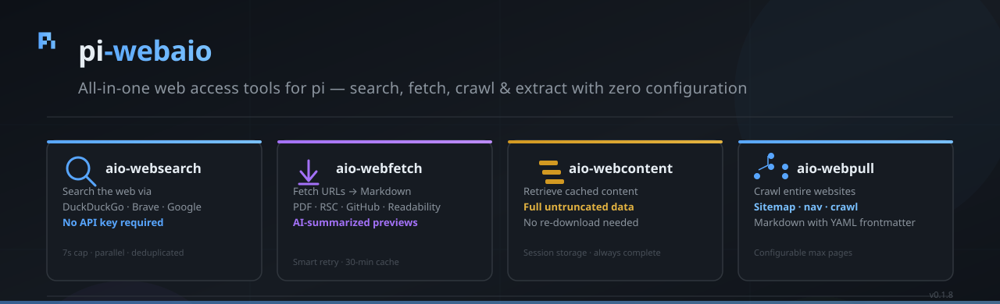

# pi-webaio

All-in-one web access tools for [pi](https://pi.dev) with search, fetch, crawl, extraction, anti-bot TLS fingerprinting, and intelligent resilience.

## Installation

```bash
pi install npm:pi-webaio
```

Or from git:

```bash
pi install git:github.com/apmantza/pi-webaio
```

## Tools

| Tool             | Description                                                                                                                                                           |
| ---------------- | --------------------------------------------------------------------------------------------------------------------------------------------------------------------- |
| `aio-websearch`  | Search the web using DuckDuckGo or Brave (no API key required). Returns compact results with title, URL, and snippet. 10-minute in-memory + disk cache.               |
| `aio-webfetch`   | Fetch a single URL (or batch of URLs) and convert to markdown with anti-bot TLS fingerprinting. Detects PDFs, GitHub repos, and Next.js RSC. Saves to temp directory. |
| `aio-webcontent` | Retrieve previously fetched content from session storage by URL. Returns **full untruncated content** — no data loss.                                                 |
| `aio-webpull`    | Pull any public website or docs site into local markdown files with anti-bot TLS fingerprinting. Discovers pages via sitemap, navigation links, or crawling.          |

## Features

### Fetching & Extraction

- **Anti-bot TLS fingerprinting** — `wreq-js` with browser profiles (`chrome_145`, `firefox_147`, `safari_26`, `edge_145`)
- **Bot-protection fallback** — Detects Cloudflare/Anubis/etc and cycles through alternate browser profiles
- **Smart retry logic** — Exponential backoff (1s → 2s) for `429/500/502/503/504` and transient network errors (`ECONNRESET`, `ETIMEDOUT`, `ECONNREFUSED`). Non-retryable (`400/401/403/404`) fail fast.
- **HTTP→HTTPS auto-upgrade** — Normalizes `http://` requests and responses
- **Cross-host redirect detection** — Surfaces a warning notice when a fetch redirects to a different domain
- **GitHub-aware fetch** — Detects repos, trees, blobs; clones repos or uses API
- **PDF extraction** — Extracts text from PDFs
- **RSC extraction** — Extracts Next.js React Server Components flight data
- **Mozilla Readability** — Article extraction
- **Defuddle** — HTML-to-markdown conversion

### Security & Safety

- **Secret scanning** — Blocks requests containing API keys, tokens, or passwords in URLs before they leave the machine
- **Prompt injection detection** — Categorizes and warns/redacts/tags suspicious content (instruction overrides, role injection, jailbreaks, system manipulation, encoding tricks, suspicious delimiters)

### Caching & Performance

- **Session cache** — 30-minute TTL, LRU eviction (max 100 entries). Keys normalized for consistency (`http://` → `https://`, root trailing slashes deduplicated).
- **Search cache** — 10-minute TTL, persisted to disk for cross-session reuse
- **Preview truncation** — `aio-webfetch` tool results show ~500 tokens in-context; **full file is always written to disk** for inspection via the `read` tool

## Usage Examples

### Search the web

```
Use aio-websearch to find the latest React documentation
```

### Fetch a URL

```
Use aio-webfetch to download https://example.com/article
```

After fetching, use the built-in `read` tool to inspect the full saved file.

### Retrieve stored content (no re-download)

```
Use aio-webcontent to get the full content from https://example.com/article
```

### Pull an entire site

```
Use aio-webpull to download https://docs.example.com (max: 50 pages)
```

## License

MIT
